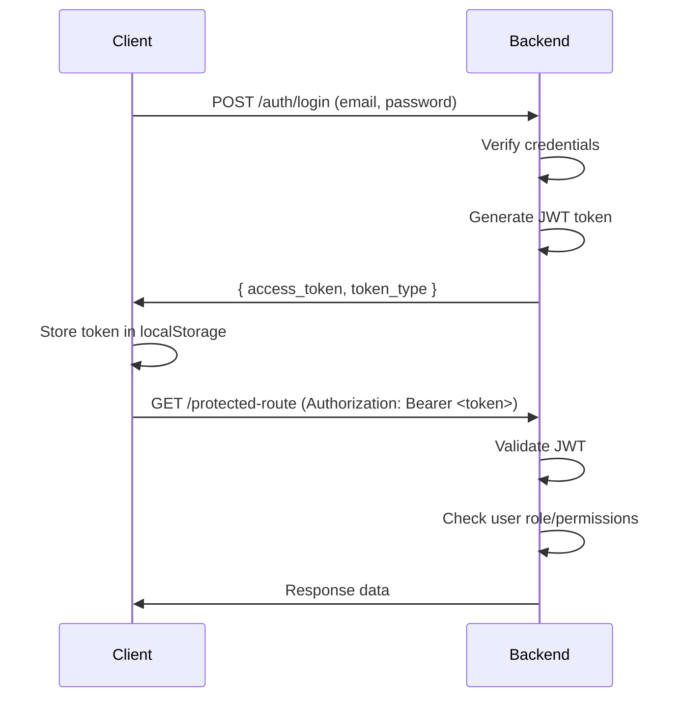
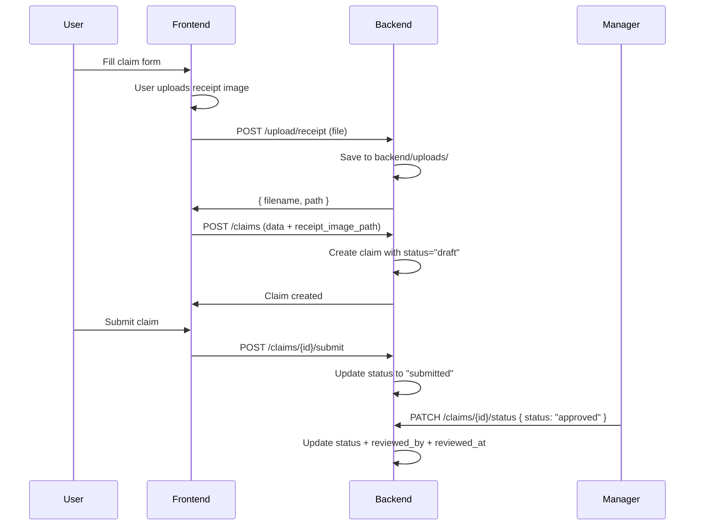
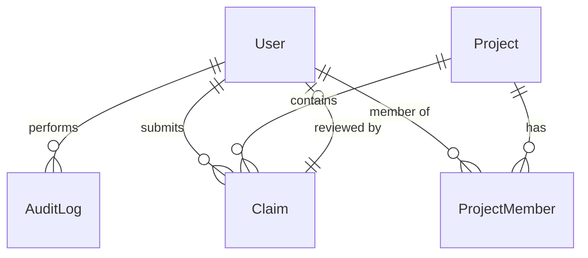

# Architecture — ReimburseEasy

## High-Level Architecture

```
┌─────────────────────────────────────────────────────────────┐
│                      Frontend (Next.js)                     │
│  ┌─────────┐  ┌─────────┐  ┌─────────┐  ┌─────────────────┐ │
│  │  Pages  │  │Components│  │  Hooks  │  │   API Client    │ │
│  └─────────┘  └─────────┘  └─────────┘  └─────────────────┘ │
└────────────────────────────┬────────────────────────────────┘
                             │ HTTP/REST (JWT Bearer)
                             ▼
┌─────────────────────────────────────────────────────────────┐
│                      Backend (FastAPI)                       │
│  ┌─────────┐  ┌─────────┐  ┌─────────┐  ┌─────────────────┐ │
│  │ Routers │  │ Schemas │  │ Models  │  │  Auth Middleware│ │
│  └─────────┘  └─────────┘  └─────────┘  └─────────────────┘ │
└────────────────────────────┬────────────────────────────────┘
                             │
                             ▼
┌─────────────────────────────────────────────────────────────┐
│                   SQLite Database                             │
│  ┌────────┐ ┌────────┐ ┌────────┐ ┌────────┐ ┌────────────┐   │
│  │ Users  │ │Projects│ │ Claims │ │AuditLog│ │ AIConfig   │ │
│  └────────┘ └────────┘ └────────┘ └────────┘ └────────────┘   │
└─────────────────────────────────────────────────────────────┘
```

## Request Lifecycle

### Authentication Flow


### Claim Submission Flow


## Database Structure

### Entity Relationships


### Tables
- **users**: id, name, email, password_hash, role, status, department, created_at, updated_at
- **projects**: id, name, description, start_date, end_date, budget_limit, status, created_by, created_at, updated_at
- **project_members**: id, project_id, user_id, assigned_by, assigned_at
- **claims**: id, user_id, project_id, receipt_image_path, merchant_name, transaction_date, amount, category, description, receipt_number, status, ai_extracted, notes, reviewed_by, reviewed_at, created_at, updated_at
- **ai_config**: id, base_url, model_name, api_key_encrypted, ocr_enabled, updated_by, updated_at
- **departments**: id, name, description, created_at, updated_at
- **audit_logs**: id, user_id, action, target_type, target_id, details, created_at

## Auth Flow Details

1. **Login**: POST /auth/login → Returns JWT access_token
2. **Protected Routes**: All routes except /auth/* require Bearer token
3. **Role Middleware**: 
   - `get_current_user`: Any authenticated user
   - `require_manager_or_admin`: Manager or Admin only
   - `require_admin`: Admin only
4. **JWT Payload**: { sub: user_id, role: role }

## File Upload Flow

1. Client sends file to POST /upload/receipt
2. Server validates:
   - File extension (.jpg, .jpeg, .png only)
   - File size (max 5MB)
3. File saved to `backend/uploads/` with UUID filename
4. Path stored in claim.receipt_image_path
5. Files served via GET /uploads/{filename}

## Directory Structure

```
pvreim/
├── backend/
│   ├── app/
│   │   ├── main.py           # FastAPI app entry
│   │   ├── database.py       # SQLAlchemy engine
│   │   ├── models.py         # ORM models
│   │   ├── schemas.py        # Pydantic models
│   │   ├── auth.py           # JWT & auth
│   │   └── routers/
│   │       ├── auth.py       # Auth endpoints
│   │       ├── claims.py      # Claims CRUD
│   │       ├── projects.py    # Projects CRUD
│   │       ├── users.py       # Users CRUD
│   │       ├── analytics.py  # Analytics
│   │       ├── upload.py     # File upload
│   │       ├── ai_config.py  # AI config
│   │       └── database.py   # DB backup/restore
│   ├── uploads/             # Uploaded files
│   ├── requirements.txt
│   └── init_db.py           # DB seeder
├── frontend/
│   ├── app/
│   │   ├── page.tsx         # Login page
│   │   ├── dashboard/       # User dashboard
│   │   ├── projects/        # Project pages
│   │   ├── claims/          # Claim form
│   │   ├── history/         # User history
│   │   └── admin/           # Admin pages
│   ├── components/          # Reusable UI
│   ├── lib/                 # Utils & API
│   └── public/              # Static assets
└── docs/                    # Documentation